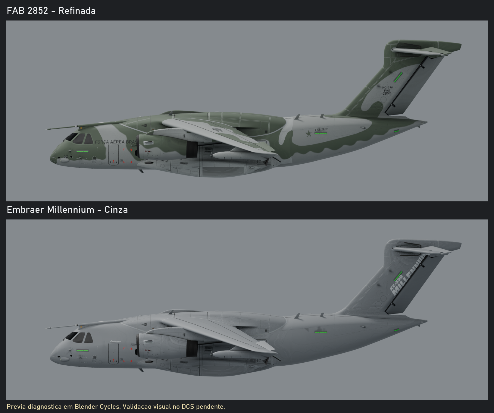

# KC-390: pinturas adicionais

## Estado da entrega: primeira versao, validacao grafica pendente

As duas pinturas foram produzidas e copiadas para a instalacao local do KC-390.
Por escolha do usuario, os DDS usados pelas duas pinturas agora sao limitados
a 1024 pixels por dimensao (1K), mantendo menores os mapas que ja eram menores.
Os arquivos DDS e os descritores passaram nos testes descritos abaixo. Ainda
nao foi possivel aprovar a aparencia no renderizador do DCS, confirmar a lista
do Editor de Missoes, comparar FPS/VRAM ou afirmar equivalencia ao F-5EM.

O teste isolado do DCS em 13/09/2026 chegou a tela de login antes de carregar a
missao. Nenhuma credencial foi lida, copiada ou alterada. A tentativa no
ModelViewer carregou o modelo original, mas nao registrou as novas pinturas.
Esses resultados nao sao classificados como testes visuais aprovados.

## Pinturas e selecao

| Nome configurado | Conteudo |
| --- | --- |
| FAB 2852 - Refinada | Camuflagem existente com tons ajustados, inscricoes refeitas, identificacao FAB 2852 no lugar das marcas PT-ZNG e vidro neutro. |
| Embraer Millennium - Cinza | Esquema cinza inspirado no demonstrador da brochura oficial, marcas FAB removidas e identificacao Embraer/KC-390 Millennium. |

Depois de iniciar o DCS normalmente, selecionar uma unidade KC-390 no Editor
de Missoes e procurar esses nomes no campo de pintura. O KC-390 continua sendo
uma aeronave de IA, nao pilotavel. Se o DCS ja estava aberto durante a copia,
reinicia-lo para refazer a descoberta de pinturas.

As pastas sao independentes da pintura original `FAB Standard`, que nao foi
alterada. Nao e necessario trocar o modelo 3D nem remover a pintura antiga.
Se as opcoes nao aparecerem, a descoberta pelo DCS ainda precisa ser corrigida;
a presenca das pastas no disco nao e prova de registro no Editor de Missoes.

## Previa de geometria e UVs



As imagens usam a cena de backup `BACKUP/KC3903D/kc-390.blend`, com materiais
adaptados para Blender Cycles. Servem para revisar UVs, letras e distribuicao
da pintura. Nao comprovam que os canais normal/RoughMet sejam utilizados pelo
EDM atual, nem representam a iluminacao final do DCS. A cena-fonte nao foi salva
ou reexportada. A orientacao da marca da cauda foi conferida nos dois lados.
As previas foram produzidas a partir das fontes editaveis antes da reducao
para 1K: a nitidez de inscricoes pequenas no jogo sera menor que nessas fontes.

## O que foi produzido

- 32 superficies tratadas por pintura, incluindo fuselagem, asas, empenagem,
  motores, trens, rampa externa e pods.
- 103 DDS por pintura: 96 mapas de cor/normal/RoughMet e 7 copias leves das
  texturas compartilhadas de cabine, porao, tripulacao e luzes de formacao.
  Cor em BC7 sRGB, normal em BC5 linear e RoughMet em BC7 linear.
- 110 associacoes de materiais por descritor, incluindo as referencias
  preservadas a texturas originais do proprio KC-390.
- Todos os DDS referenciados pelas duas pinturas sao de no maximo 1024x1024.
  Proporcoes preservadas: a faixa de luzes de 2048x256 passou a 1024x128.
  Os mapas menores existentes, de 256x256 e 4x4, nao foram ampliados.
- Cadeias completas de mipmaps; os mapas quadrados de 1024x1024 possuem 11
  niveis. Fontes PNG/ORA de maior resolucao foram preservadas fora do mod.
- Aproximadamente 131,02 MiB de DDS por pintura, 262,03 MiB para as duas:
  reducao de cerca de 69% em relacao aos 837,7 MiB anteriores.
  Esse tamanho nao equivale ao consumo medido de VRAM durante uma missao.
- 64 fontes OpenRaster (`.ora`), com pintura-base, inscricoes e referencia
  original em camadas, mais os PNGs de normal e RoughMet.

Os detalhes de relevo sao uma extracao conservadora de contraste da textura
antiga, com intensidade limitada. Nao sao um bake de um modelo high-poly.
As mascaras de metal/borracha tambem sao aproximacoes por regiao e cor e
precisam de revisao no renderizador. Nao foram reconstruidas todas as linhas
de paineis, rebites e inscricoes tecnicas a partir de desenhos industriais.

Os dois canais originais `SELF_ILLUMINATION` foram preservados por nome
simbolico. O canal alpha foi mantido antes da compressao; BC7 e uma compressao
com perdas. O comportamento de transparencia dos vidros ainda depende do EDM.

## Referencias e fidelidade

- [Brochura oficial Embraer, marco de 2026](https://www.embraer.com/media/ukxhsx3o/brochura-kc-390-millennium-eng-mar-2026.pdf): fotografias e marca KC-390 Millennium; pagina 46 usada na revisao lateral.
- [Pagina oficial do KC-390](https://www.embraer.com/defense-security-air/kc-390-millennium/en/).
- Pintura FAB existente no mod, mantendo o credito a FABv/Vynicius/VS Mod.
- F-5EM local como referencia de organizacao dos mapas; nenhuma textura do
  F-5EM ou de um modulo pago foi copiada para as novas pinturas.

O demonstrador cinza nao recebeu uma matricula inventada: a referencia usada
nao permitiu confirmar uma identificacao legivel. Os cinzas e verdes sao
aproximacoes visuais, nao codigos oficiais de tinta. A FAB preserva a composicao
da pintura recebida, com identificacao coerente; ainda nao ha certificacao
fotografica completa de cada marcacao em todos os lados da FAB 2852.

A brochura completa fica apenas na area de trabalho local, fora deste pacote.
As marcas reproduzidas identificam a aeronave; este mod nao e um produto oficial
ou endossado pela Embraer. As restricoes e os creditos do projeto original
continuam aplicaveis; verificar as permissoes antes de redistribuir derivados.

## Validacoes realizadas

| Verificacao | Resultado |
| --- | --- |
| 84 DDS originais decodificados e registrados por SHA-256 | Aprovado |
| 206 DDS das pinturas: cabecalho, formato, mipmaps, leitura e hash | Aprovado |
| Todas as referencias de textura das duas pinturas limitadas a 1024 | Aprovado |
| Descritores executados no Lua 5.1 fornecido pelo DCS | Aprovado |
| 220 associacoes: arquivos presentes e sem duplicatas | Aprovado |
| 64 fontes OpenRaster: ZIP integro e tres camadas | Aprovado |
| Vinculos das 32 superficies na cena Blender de backup | Aprovado |
| Copia para as duas pastas locais de pintura, por hash | Aprovado |
| Uso efetivo dos normal maps e RoughMet pelo EDM | Pendente |
| Lista de pinturas e renderizacao no DCS | Bloqueado no login |
| Comparacao de desempenho, VR, noite e quatro LODs | Pendente |
| Equivalencia visual ao F-5EM | Nao demonstrada |

Os quatro EDMs visuais e as texturas originais ficaram intactos. Alteracoes
simultaneas em parametros de dano e malha de colisao foram preservadas e nao
fazem parte desta entrega. O arquivo normal de opcoes do DCS ficou identico
ao snapshot anterior ao teste, incluindo VR e launcher.

## Fontes e reproducao local

Area de trabalho desta producao: `%LOCALAPPDATA%\KC390-Liveries`.

- `sources/fab` e `sources/embraer`: fontes `.ora` e PNGs.
- `baseline.json`: hashes das texturas e modelos anteriores a producao.
- `validation.json`: verificacoes de arquivos e estado de validacao grafica.
- `resize-1024.json`: dimensoes-alvo e tamanhos antes/depois da reducao.
- `deployment.json`: arquivos realmente copiados para a instalacao e hashes.
- `renders`: imagens de diagnostico e seus registros de renderizacao.

Requisitos: Python 3.14, dependencias de
[requirements-liveries.txt](../tools/requirements-liveries.txt), `lua` no PATH,
DirectXTex `texconv.exe` oficial da Microsoft na area de trabalho e, para
diagnostico 3D, Blender 5.1.2. O conversor usado foi 2026.5.8.1.
O script de renderizacao tem seu proprio Python dentro do Blender.

```powershell
$python = "$env:LOCALAPPDATA\KC390-Liveries\.venv\Scripts\python.exe"
& $python -m unittest discover -s tools -p test_liveries.py -v
& $python tools/liveries.py validate
& $python tools/liveries.py resize
& $python tools/liveries.py build --part kc-390_fuselage_a1_c
& $python tools/liveries.py deploy
```

`resize` reexporta somente DDS acima de 1024 a partir dos PNGs existentes, sem
alterar as fontes editaveis. As duas pinturas sao verificadas em uma area
temporaria antes da troca. As dependencias compartilhadas maiores ganham copias
locais em 1K, preservando a pasta de texturas original e a pintura FAB Standard.

`build` tambem exporta DDS limitados a 1024, mas regenera DDS e fontes:
conservar separadamente qualquer edicao artistica
manual nos PNGs/ORA antes de executa-lo. O script recusa sobrescrever DDS
modificados depois do manifesto. `deploy` recusa sobrescrever arquivos locais
de origem desconhecida ou que tenham mudado depois da instalacao registrada.

O comando `audit` cria o snapshot inicial em uma nova area de trabalho;
`sample --dds` produz somente uma amostra da fuselagem. `prepare-dcs` prepara
um perfil temporario de teste, mas nao autentica nem inicia o simulador. Nao
existe trabalho ou teste continuando em segundo plano depois desta entrega.

Para retornar visualmente ao estado anterior, selecionar `FAB Standard`.
Para remover as novas opcoes, retirar somente as duas pastas de pintura que
constam no manifesto de instalacao, preservando possiveis edicoes posteriores.
Nenhuma restauracao de EDMs, DLLs, texturas originais ou opcoes do DCS e necessaria.