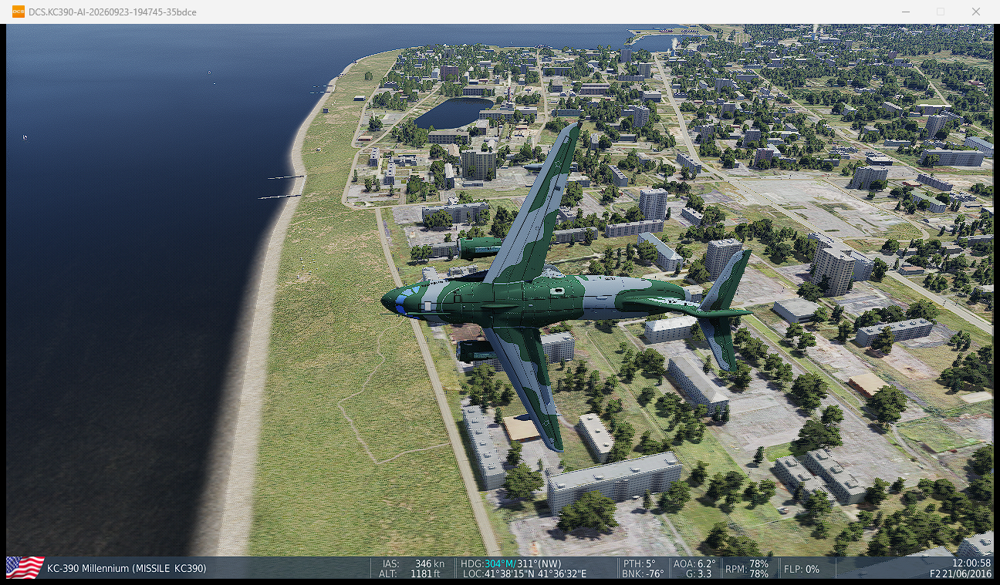
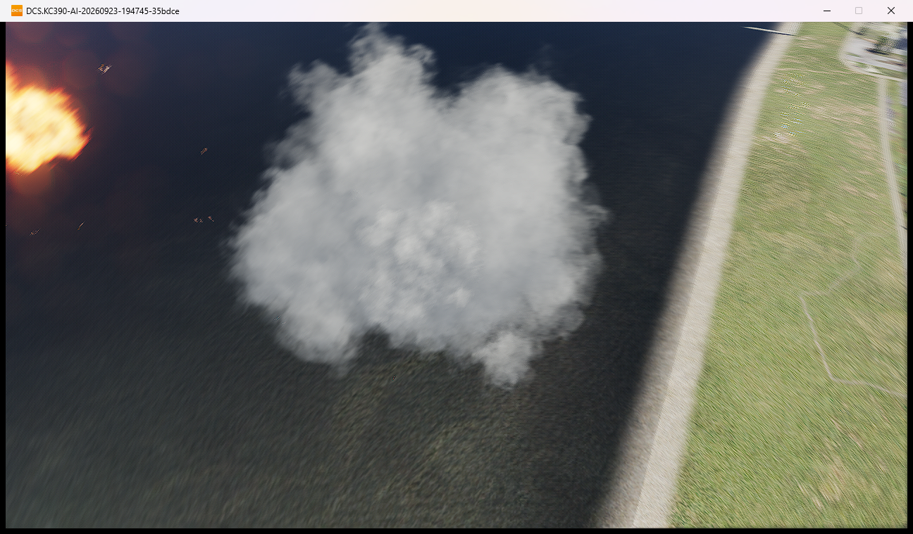
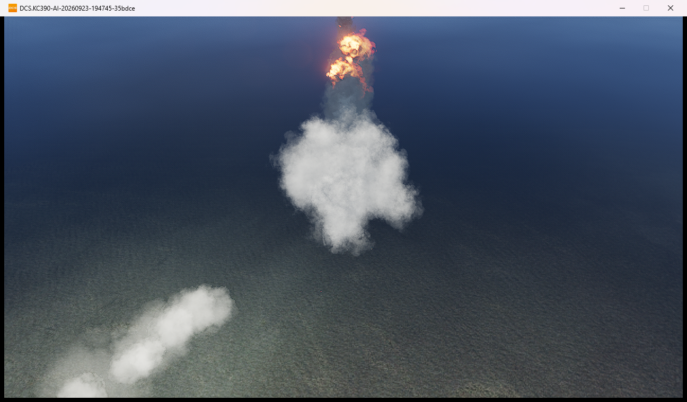
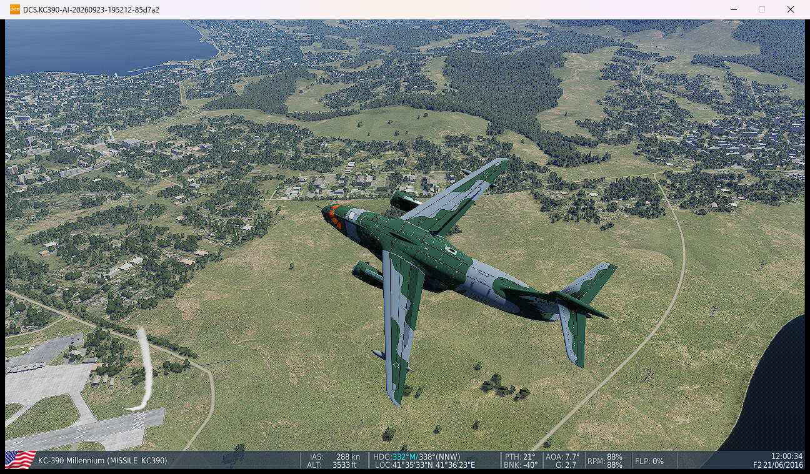
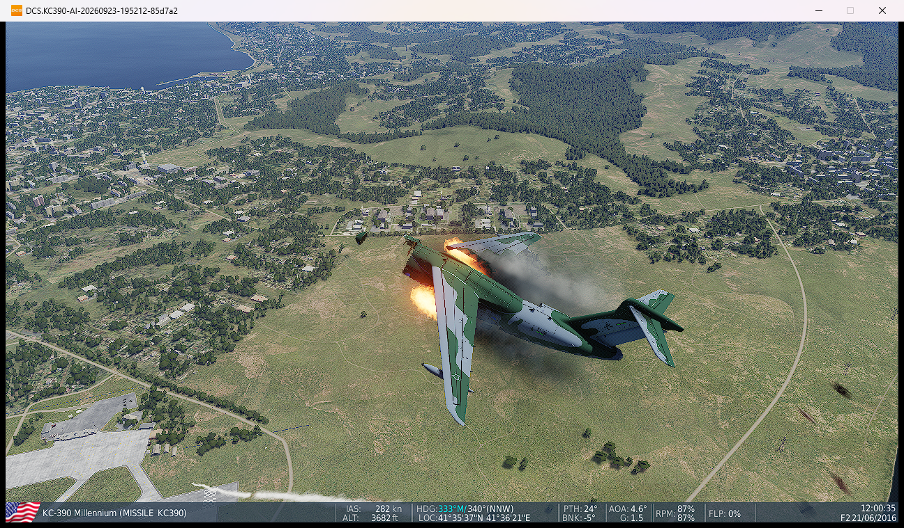
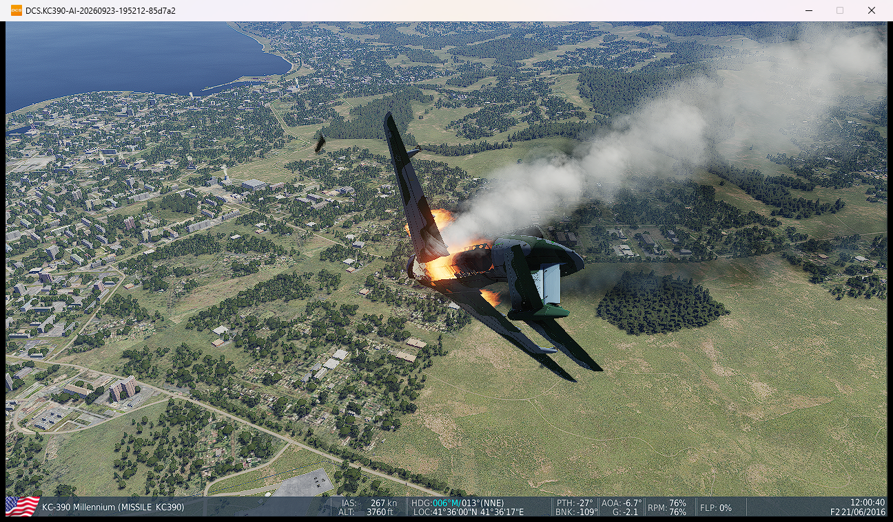
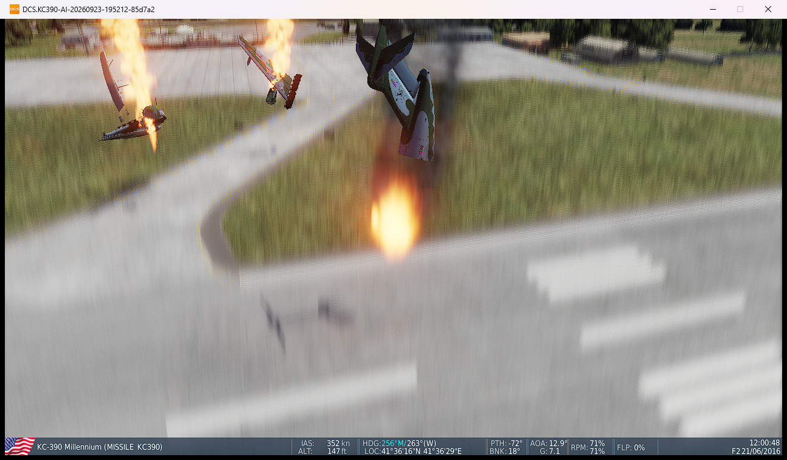

# KC-390: teste nativo de impacto de míssil — 23/09/2026

## Método

- DCS 2.9.29.27468, executável `bin-mt`, renderização ligada.
- Mesmos modelos e definição Lua instalados em Saved Games, conferidos por hash antes do teste.
- Lançadores nativos, sem `trigger.action.explosion`, dano forçado ou escrita nos argumentos do avião.
- KC-390 alvo com 20 HP; contramedidas zeradas somente na missão de teste.
- Outro KC-390 a 40 km, sem ataque, verifica vida, combustível, movimento e argumentos de dano intactos.
- Perfis temporários; sem mudanças em DLLs, gráficos, VR ou opções do perfil normal.
- Câmera posicionada antes de liberar o lançador; acompanhamento posterior feito pela câmera nativa.

## Radar: Tor / SA9M330 — aprovado para impacto e destruição

Evidência original: pasta temporária `KC390-AI-20260923-194745-35bdce`.

| Medida observada | Resultado |
|---|---|
| Lançamentos nativos | 2, aos 52,651 s e 56,928 s |
| Impacto identificado | `SA9M330`, aos 60,161 s, lançador `MISSILE_LAUNCHER` |
| Munição do lançador | 8 → 6 |
| Aeronave atingida | Removida após impacto; eventos de perda/crash no mesmo instante |
| Controle sem ataque | 20 HP, 12.581,5 m percorridos, combustível consumido, argumentos de dano zerados |
| Encerramento | Código 0, sem timeout ou exceção nativa detectada |
| Preservação | Opções e fontes inalteradas; perfil e cópias temporárias de autenticação removidos |

A amostragem de 0,1 s não capturou um estado intermediário de vida/argumentos: o alvo passou de 20 HP à remoção. O `minLife=20` e `peak=0` do relatório não significam invulnerabilidade; a prova de destruição é o impacto identificado seguido da perda do alvo, não uma vida zero inventada.

### Sequência real capturada

Antes do impacto:

Logo após o impacto, explosão e fragmentos:

Fragmentos e efeitos afastando-se:

As imagens comprovam fragmentação visível neste caso, mas fumaça, enquadramento e distância não permitem identificar e certificar separadamente nariz, duas asas e rampa. Não há afirmação de que toda peça se destaque em qualquer impacto.

## Infravermelho: Strela-10M3 / SA9M333 — sequência visual

Evidência original: pasta temporária `KC390-AI-20260923-195212-85d7a2`. Capturas dessa execução usam milissegundos no nome e intervalo nominal de 0,5 s (não são um vídeo nem uma medição de FPS).

O lançamento nativo foi observado aos 29,787 s e 34,378 s. O evento de impacto identificou `SA9M333` e o lançador `MISSILE_LAUNCHER` aos 34,457 s; o alvo deixou de existir na API de unidades aos 34,5 s. Isso não significa que o destroço visual desapareceu: a câmera continuou mostrando a queda.

Resultado final do observador: `PASS`, dois lançamentos e dois eventos aceitos de impacto (não uma certificação de dois acertos independentes, pois o DCS pode repetir eventos). A contagem total de munição foi 1.026 → 1.024; o inventário inicial inclui oito mísseis e munição de 7,62 mm, por isso esse número **não representa 1.026 mísseis**. Os lançamentos registrados são categoria `MISSILE` e tipo `SA9M333`. O controle terminou com 20 HP, 8.997,0 m percorridos e nenhum argumento de dano. Encerramento código 0, sem timeout/crash detectado; fontes e opções normais preservadas e perfil temporário removido.

Antes do impacto, com rastro do míssil na cena:

Após o impacto: seção dianteira ausente e fragmento afastado, fogo e fumaça:

Queda com fragmento separado do corpo principal:

Peças grandes, incluindo geometria de asa, separadas do corpo principal junto ao solo:

A última imagem é próxima ao contato com o solo: ela não prova que todas essas peças já tinham se soltado no instante do míssil. A sequência confirma ruptura após o acerto e fragmentação adicional durante a queda/contato. Não há afirmação de separação simultânea de todas as peças.

## Limites

- Teste de software do simulador, não estimativa de resistência real do KC-390.
- Não certifica todos os mísseis, todas as direções de impacto, multiplayer ou eficiência de contramedidas.
- Não foi necessário alterar a vida ou a geometria do pacote para obter o resultado Tor.
- Também não foi necessário alterar a vida ou a geometria para a ruptura e queda observadas com o Strela. Os modelos testados continuam iguais aos instalados em Saved Games.
- Os logs trazem um aviso do DCS sobre o preset `missile` de `volumetricPointLight.lua`, com fallback para o padrão. Os efeitos de fogo/fumaça foram visíveis; não foram modificados arquivos de efeitos globais para esse aviso.
- Os seis testes locais do observador rejeitam ausência de lançamento, míssil que erra, tiro de canhão, atacante diferente e controle danificado.